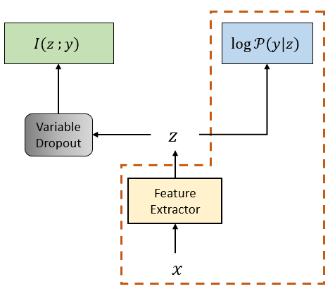
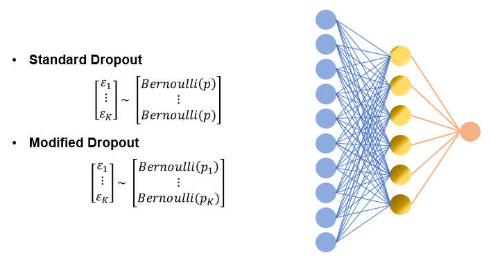

# Variable Information Dropout

Variable Information Dropout is a method to regulate the relative amount of information in the hidden units of a layer. This is achieved
by feeding in varying degrees of noise into the latent variables before passing them for a downstream task of interest. The general framework
of the method is outlined below:
<p align="center">
    
</p>

The area marked with dashed lines is the typical training pipeline. In addition to the this, an auxilary loss function is added that maximizes the mutual information between the latent variables and the desired variable (which in general cases can be the task label). But before being passed to the auxiliary loss function, the latent variables are masked with bernouilli noise with each mask sampled from different underlying Bernoulli distributions (i.e. distributions with different means). An illustrative diagram is shown below:

<p align="center">
    
</p>

In addition to regulating the information content, this method also acts as a strong regularizer. And unlike standard dropout, regularization happens without any loss in the model capacity.

## Setup

```
git clone https://github.com/mohith-sakthivel/variable-info-dropout.git
cd variable-info-dropout

conda env create -f environment.yml
conda activate vid
```

## Run
* To run code, use
    ```
    python3 -m vid.vid
    ```
